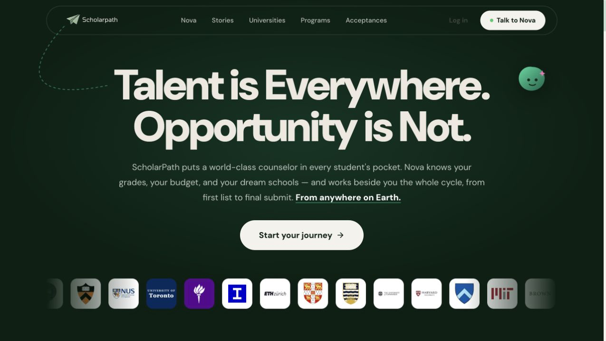
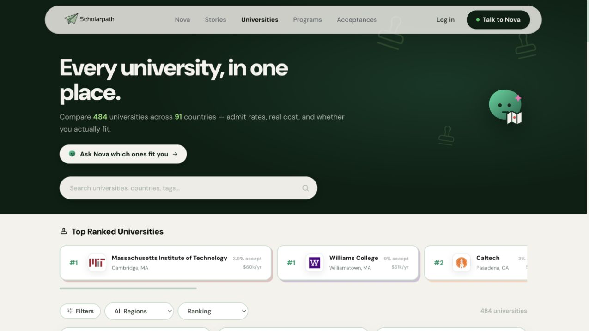
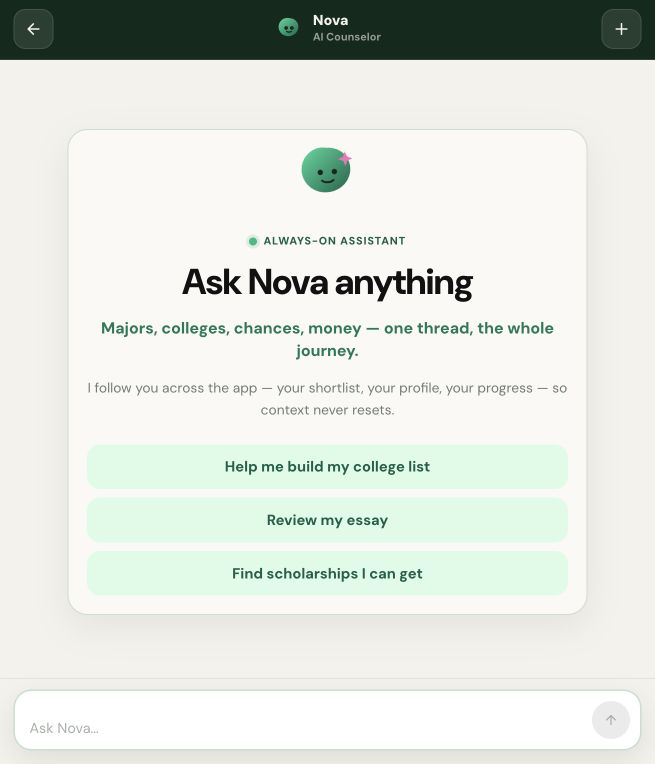
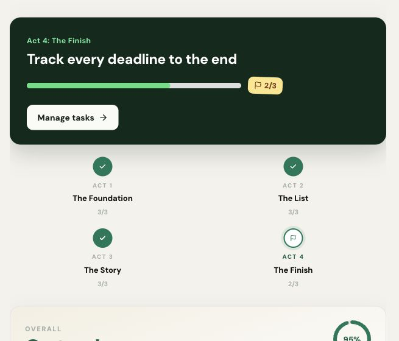

<div align="center">
  

# ScholarPath

**Talent is everywhere. Opportunity is not.**

A free, personal admissions workspace for students applying to universities around the world.

[Try ScholarPath](https://scholarpaths.org) · [Explore universities](https://scholarpaths.org/universities) · [Talk to Nova](https://scholarpaths.org/nova)
</div>



## Why I built this

Applying to university as an international student felt like trying to assemble a map from hundreds of disconnected pieces.

One website had deadlines. Another had tuition. Financial-aid rules were hidden several pages deep, advice was usually written for students in a completely different school system, and every important decision seemed to come with ten new tabs. A counselor could have made the process clearer, but great counseling is expensive and not available to everyone.

That bothered me. A student's chances should not depend on whether their family can pay thousands of dollars for someone to explain the process.

So I started building ScholarPath: the admissions counselor and organized workspace I wished I had. The long-term goal is simple, even if building it is not: **give every student access to thoughtful, personal admissions guidance, wherever they live and whatever they can afford.**

## What ScholarPath is

ScholarPath brings the whole application journey into one place. It is not just a university directory, and Nova is not meant to be a generic chatbot floating beside one.

Students can build a profile, compare universities, discover programs and scholarships, organize essays and activities, track deadlines, and ask Nova questions with the context of what they have already done. The product is organized as a four-act journey:

1. **The Foundation** — understand the student: academics, interests, budget, country, and goals.
2. **The List** — find universities that make sense and build a balanced shortlist.
3. **The Story** — organize activities and improve essays while keeping the student's own voice.
4. **The Finish** — manage tasks, deadlines, scholarships, and every last submission detail.

## What you can do

- **Talk to Nova.** Ask about majors, universities, admission chances, essays, scholarships, and next steps. Nova uses the student's profile and workspace instead of starting from zero every conversation.
- **Explore universities worldwide.** Search and compare 484 universities across 91 countries using cost, acceptance rate, region, academic interests, financial aid, and other useful context.
- **Discover programs and scholarships.** Find opportunities for both high-school and university students, with official links and clear deadline information.
- **Build an application workspace.** Keep college lists, tasks, essays, activities, deadlines, and calendar events connected.
- **Track the whole journey.** ScholarPath turns a huge process into smaller milestones and shows what needs attention next.
- **Keep essays human.** Nova can review a draft and explain what works or feels weak, but it is designed not to write the essay for the student.

## Inside the product

### Find universities without opening fifty tabs



ScholarPath combines practical details with a calmer way to browse. The aim is not to tell every student to apply to the same famous universities. It is to help them ask better questions: Can I afford this? Does it support international students? Does it actually fit what I want to study?

<table>
  <tr>
    <td width="50%">
      
    </td>
    <td width="50%">
      
    </td>
  </tr>
  <tr>
    <td align="center"><strong>Nova remembers the journey</strong></td>
    <td align="center"><strong>One map from profile to submit</strong></td>
  </tr>
</table>

## Nova, the counselor

Nova is the part of ScholarPath I care about getting right the most. Admissions advice can shape major life decisions, so a confident-sounding answer is not enough.

Nova is built as a tool-using AI agent. It can read the student's profile, university list, tasks, programs, and progress; reason about what is missing; and use focused tools instead of pretending it knows everything. The goal is useful honesty: explain the reasoning, admit uncertainty, and point students back to official sources when a fact can change.

Nova also follows an important boundary: it helps students plan and improve their work, but it should never replace their voice or invent achievements for them.

```text
React app
    |-- Supabase Auth + RLS --> profiles, lists, essays, tasks and scholarships
    |
    `-- authenticated Nova request
            |
            v
        Express API  -- token verification and rate limits
            |
            v
        Nova FastAPI service  -- LangGraph agent and focused tools
            |
            `-- server-side Supabase tools and vector search
```

## Built with

| Part | Technology |
| --- | --- |
| Frontend | React 19, Vite, React Router, Lucide icons |
| Main API | Node.js, Express, Helmet, server-side rate limiting |
| Nova agent | Python, FastAPI, LangGraph, Groq and Gemini |
| Database and auth | Supabase, PostgreSQL, Row Level Security |
| Email and notifications | Resend SMTP and Firebase Cloud Messaging |
| Deployment | Vercel |

The browser never receives service-role credentials. Supabase verifies the user's session and Row Level Security protects user-owned workspace data. Nova requests are checked again by the Express API, and communication between the main API and the agent uses a separate internal secret.

## What I learned

The hardest part was not making another polished page. It was connecting everything into a system that feels like it remembers where a student is going.

I learned that authentication has a lot more edge cases than a login form suggests, AI needs narrow tools and boundaries to stay useful, university data becomes outdated surprisingly quickly, and responsive design is not finished when the homepage happens to look good on a phone. I also learned to test the boring paths: expired codes, missed redirects, empty dashboards, slow APIs, and the email that never arrives.

ScholarPath is already live, but I still think of it as an active beta. Some university and deadline information can change, so students should always confirm critical details on the official institution website. I would rather be honest about that than make the product sound magically complete.

## Roadmap

- [ ] Expand and continuously verify university, program, and scholarship data.
- [ ] Make Nova's recommendations more explainable, with clearer sources and confidence.
- [ ] Support more application systems and country-specific admissions paths.
- [ ] Add a mentor or counselor view so students can choose to collaborate with someone they trust.
- [ ] Improve low-bandwidth performance and accessibility for students using older devices.
- [ ] Keep testing with real students and build from the problems they actually have.

The big plan is for ScholarPath to grow from a useful application workspace into a genuinely dependable counselor: one that knows the student, keeps the process organized, and makes high-quality guidance normal instead of exclusive.

## Run it locally

### Frontend

```bash
git clone https://github.com/thedude1215/Student_Counselor.git
cd Student_Counselor
npm install
npm run dev
```

The frontend expects these values in `.env`:

```bash
VITE_SUPABASE_URL=your_supabase_url
VITE_SUPABASE_ANON_KEY=your_supabase_anon_key
VITE_API_URL=http://localhost:8787
```

### Full stack

The complete local setup also needs Python 3.11+ for Nova:

```bash
python3 -m venv nova-agent/.venv
source nova-agent/.venv/bin/activate
pip install -r nova-agent/requirements.txt
npm start
```

The Express API and Nova service require their own Supabase, model-provider, Firebase, and internal-service environment variables. Never commit service-role keys or API secrets. The most important variable names are documented where they are read in `server/` and `nova-agent/app/config.py`.

## A note for other student builders

This project started with a problem I understood personally, then became much bigger than my first version. That is probably my favorite part of building it. I am still learning, still finding assumptions I got wrong, and still rewriting pieces that looked finished a week earlier.

If you are building something ambitious, you do not need to know the entire path before you begin. You need a reason to care, a first version, and enough stubbornness to keep making the next version better.

Feedback, issues, and ideas are welcome. You can also try the live project at **[scholarpaths.org](https://scholarpaths.org)**.
